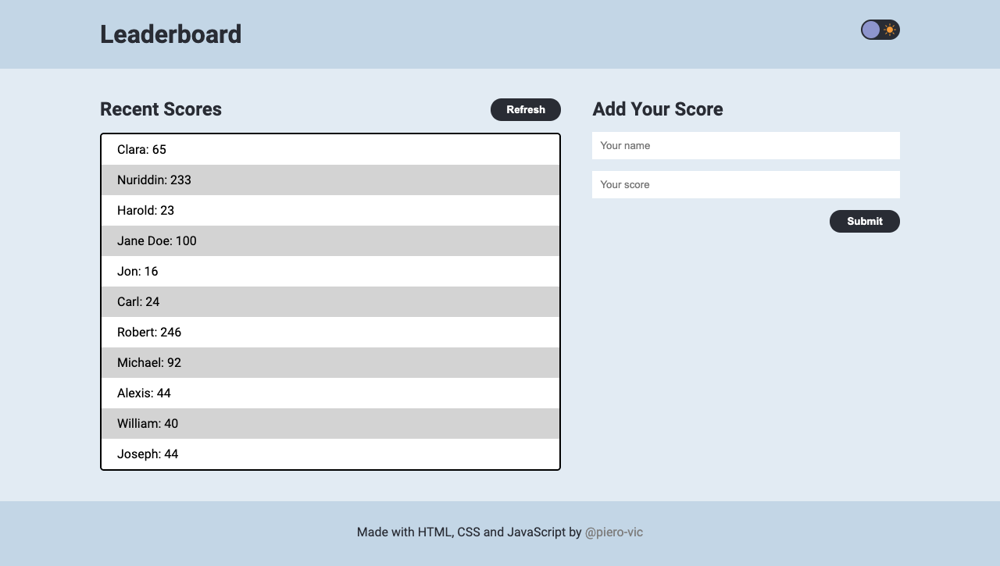
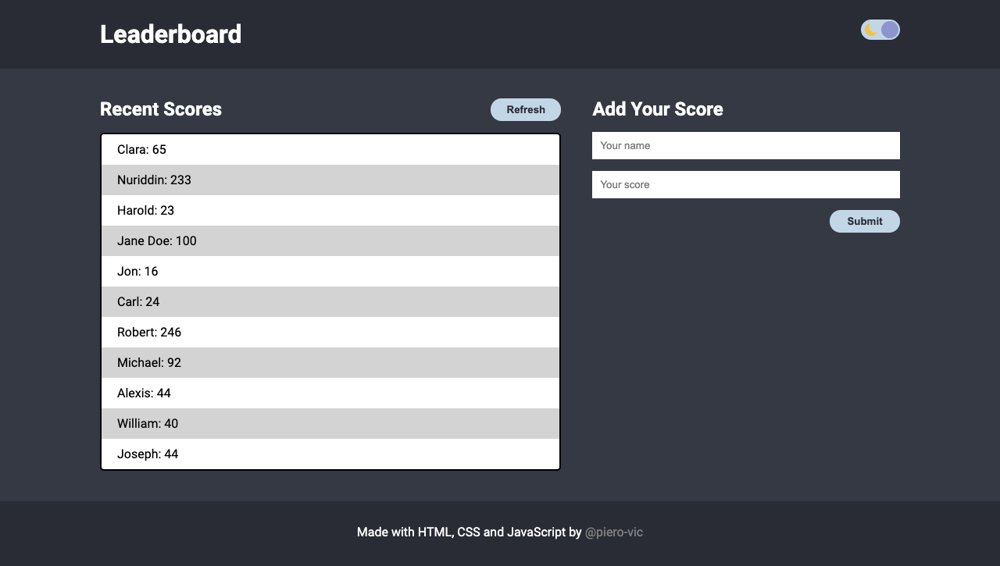

# Leaderboard

> Leaderboard project for Microverse.



<details>

<summary>Dark Mode</summary>



</details>

## Built With

- HTML
- CSS
- JavaScript
- Webpack

## Getting Started

Clone the repo and enter the directory.

```shell
git clone https://github.com/piero-vic/Leaderboard.git && cd Leaderboard
```

After this you can run the app by opening `index.html` under the `src` directory.

If you want to experiment with the app follow these simple example steps.

### Prerequisites
You need to have `npm` installed on your local machine.

### Install
Install the npm packages.

```shell
npm install
```

### Usage

Run `npm run start` to start the local server and try the app.

```shell
npm run start
```


## Author(s)

👤 **Piero Lescano**

- GitHub: [@piero-vic](https://github.com/piero-vic)
- Twitter: [@v1ccenzo](https://twitter.com/v1ccenzo)
- LinkedIn: [piero-lescano](https://linkedin.com/in/piero-lescano)

## Show your support

Give a ⭐️ if you like this project!
